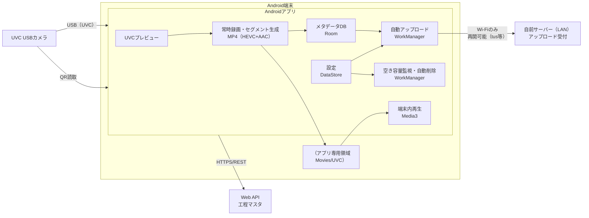

# 基本設計書（Android：UVC録画・作業紐づけ・自前サーバーアップロード）

## 1. 本書の位置づけ
- 本書は、要件定義書で定義された要件を実現するための基本設計（構成、画面、状態、データ、処理フロー、例外、設定）を記載する。
- 要件は「Androidアプリ要件定義書」を正とし、本書はその実現方法を定義する。
- 本書では「後工程（詳細設計/実装/試験）で迷わない」ことを優先し、合意可能な粒度で決定する。

### 1.1 対象スコープ
- UVC接続/許可取得/切断時制御
- プレビュー開始/停止
- 常時録画（セグメント生成）とセグメント分割
- 作業（型式/機番/工程）の入力・開始/中断/再開/終了と録画紐づけ
- 録画一覧（作業単位のグルーピング、未割当の確認/救済）
- 端末内再生
- Wi‑Fi限定の自前サーバー自動アップロード（再開可能）
- 空き容量閾値に基づく自動削除

### 1.2 本書で確定しない事項
- サーバー側仕様（認証、DB、保存構造、検索UI 等）は別資料で定義する
- Web API（工程マスタ）の詳細仕様（認証/エラーコード体系 等）は別資料で補完可能とするが、本書ではAndroid実装に必要な最小I/F（取得方法・レスポンス項目）を定義する

## 2. 前提・採用技術（実装方針）
### 2.1 対応環境
- 対応OS: Android 7.0（API 24）以上
- USB OTG対応端末 + UVC準拠USBカメラ

### 2.2 採用ライブラリ/主要API
- UVC: AndroidUSBCamera（libausbc/libuvc）
- UI: Jetpack Compose（Material3）
- 再生: AndroidX Media3（ExoPlayer）
- 録画継続: Foreground Service（録画中の常駐通知を含む）
- バックグラウンド処理: WorkManager（アップロード/クリーンアップ）
- 設定永続化: DataStore（Preferences）
- メタデータ永続化: Room（作業/セグメント/アップロード状態）

補足:
- 既存実装では `Movies/UVC` への保存と Media3 再生、HEVC+AAC mux を行っている。将来要件（作業紐づけ/アップロード/削除）を追加しても、既存の録画・再生経路を破壊しないことを前提とする。

## 3. システム構成
### 3.1 構成要素
- Androidアプリ
	- UVCプレビュー/録画（セグメント生成）
	- 作業入力（QR + 工程選択）
	- 一覧/紐づけ/再生
	- Wi‑Fi限定アップロード（再開可能）
	- 空き容量監視と自動削除
- UVC USBカメラ
- Web API（工程マスタ取得）
- 自前サーバー（LAN）
	- 再開可能アップロード（tus等）受付

### 3.2 データフロー概要
1) UVCからプレビュー取得
2) プレビュー中に録画（常時）し、一定間隔/作業操作/エラーでセグメント確定
3) セグメントに作業ID（workId）を付与（未割当/割当済み）
4) 割当済みセグメントのみ、Wi‑Fi時に自動アップロード（再開可能）
5) 空き容量閾値未達時、未割当→アップロード済みの順で自動削除

### 3.3 システム構成図


補足:
- 未割当セグメント（workIdなし）はアップロード対象外。
- 自動削除は「未割当」→「アップロード済み」の順で古いものから実施する。

## 4. 画面設計
要件で定義された最小画面（メイン/一覧/再生）に限定し、本書では各画面の表示/入力/ボタン活性条件を定義する。

### 4.1 画面一覧
- メイン画面（プレビュー + 作業操作 + 状態表示 + 一覧導線）
- 一覧画面（作業単位グルーピング + 未割当 + 後追い紐づけ）
- 再生画面（動画プレイヤー + 基本操作 + 全画面）

### 4.2 メイン画面
#### 4.2.1 目的
- UVCプレビューの開始/停止
- 常時録画（セグメント生成）の開始/停止
- 作業情報（型式/機番/工程）の入力・作業開始/中断/再開/終了
- 録画状態/容量/アップロード状態の把握

#### 4.2.2 UI要素（最小）
- プレビュー領域
- 接続状態表示（未接続/接続中/許可待ち/エラー）
- 録画状態表示（録画中インジケータ、経過時間、セグメント確定中）
	- 録画中は常駐通知が表示される前提（ユーザーが録画継続を把握できる）
- 作業情報入力
	- 型式/機番: QR読み取りボタン（端末カメラ起動）＋読取結果表示
		- 工程: 工程マスタ取得→選択UI（選択結果表示、保存済み工程は初期表示）
- 作業操作ボタン
	- 作業開始 / 中断 / 再開 / 終了
	- いずれも「音声指示」または「ボタン」で実行可能（音声は代替としてボタンを必ず提供）
- 設定入力（最小）
	- セグメント分割間隔（1〜10分）
	- 録画コーデック（互換モード）: H.265（既定）/ H.264
	- 最小空き容量閾値
	- アップロード先URL
	- 設定の変更は「次セグメントから」など要件に従う
- 一覧画面への導線

#### 4.2.3 ボタン活性条件
- プレビュー開始: UVC接続中、かつUSB許可済み
- 録画開始: プレビュー開始中、かつUVC接続中
- 作業開始の成立条件（要件準拠）
	- QR読取により型式/機番が取得済み
	- 工程が選択済み（工程マスタ取得、またはキャッシュ/暫定工程で選択済み）
	- 作業開始トリガ（音声 or ボタン）が実行された
- 作業中断/再開/終了: 作業状態により活性（状態遷移は「5. 状態設計」）

### 4.3 一覧画面
#### 4.3.1 目的
- 作業単位のグルーピング表示（作業一覧→作業内セグメント一覧）
- 未割当セグメント一覧
- 後追い紐づけ（未割当→任意のworkIdへ割当）

#### 4.3.2 表示仕様
- 作業一覧: 作業開始日時の新しい順
- 作業内セグメント: 録画日時の古い順
- 未割当セグメント: 録画日時の古い順（削除優先に合わせるため）
- 表示項目（最小）
	- セグメント: 録画日時/長さ/サイズ/アップロード状態（割当済みのみ）
	- 作業: 型式/機番/工程/開始-終了/割当済みセグメント数

#### 4.3.3 後追い紐づけ操作
- 未割当セグメントを選択し、紐づけ先の作業（workId）を選択して確定
- 確定後のセグメントは「割当済み」となり、アップロード対象へ移行
- 既にアップロード済みの未割当は存在しない（未割当はアップロードしないため）

### 4.4 再生画面
#### 4.4.1 目的
- 端末内の録画ファイル再生
- 再生/一時停止/シーク/全画面

#### 4.4.2 再生不可時の扱い
- HEVC非対応/ファイル破損などで再生できない場合
	- アプリはクラッシュしない
	- 画面上で「再生不可」を明示
	- 可能であれば「映像のみ再生（音声トラック除去）」の救済を提供する（実装可否は端末依存のため、失敗時は明示する）

## 5. 状態設計（状態遷移）
### 5.1 カメラ/プレビュー/録画
#### 5.1.1 状態定義
- CameraConnectionState
	- DISCONNECTED: 未接続
	- PERMISSION_REQUIRED: 接続済み、USB許可待ち
	- CONNECTED: 接続済み
	- ERROR: エラー
- PreviewState
	- STOPPED: 停止
	- STARTING: 開始中
	- RUNNING: 実行中
	- STOPPING: 停止中
- RecordingState
	- OFF: 録画停止
	- ON: 録画中
	- FINALIZING: ファイル確定中
	- ERROR: エラー

#### 5.1.2 主要遷移
- USB切断: PreviewState=STOPPING→STOPPED、RecordingState=FINALIZING→OFF（可能な範囲で確定）
- 画面回転/アクティビティ再生成:
	- 原則: プレビュー/録画を継続する（必要に応じて `configChanges` 等で制御）
- 録画開始/停止: ユーザー操作、または容量不足/エラーによる停止

補足（止まらない録画の前提）
- 録画（常時録画・セグメント生成）は Foreground Service を前提とし、画面OFF/バックグラウンドでも継続する
- 録画中は常駐通知を表示する
- 省電力設定（Doze/バッテリー最適化）により停止し得る端末があるため、必要に応じて注意喚起（設定確認）を行う

### 5.2 作業状態
#### 5.2.1 状態定義
- WorkState
	- NONE: 作業未開始（または終了後）
	- ACTIVE: 作業中
	- PAUSED: 作業中断

#### 5.2.2 作業操作とセグメント境界
要件に従い、作業操作（開始/中断/再開/終了）実行時は必ずセグメント境界を切る。

操作別の紐づけ:
- 作業開始: 以降に確定するセグメントは workId に紐づく
- 作業中断: 以降に確定するセグメントは未割当
- 作業再開: 以降に確定するセグメントは同一 workId に紐づく
- 作業終了: 以降に確定するセグメントは未割当

#### 5.2.3 ワーク切替（要件 5.4.4.1）
- 旧ワークが ACTIVE/PAUSED の状態で新しい作業開始が成立した場合
	- 旧ワークを自動的に終了（終了扱い）
	- セグメント境界を切る（旧ワーク終了/新ワーク開始の双方で境界が明確になるようにする）
	- 新ワークを開始し、新規 workId を発行

## 6. 録画・セグメント設計
### 6.1 録画形式
- コンテナ: MP4
- 映像: H.265（HEVC）を基本とし、互換モードとしてH.264（AVC）を選択可能とする
- 音声: AAC

### 6.2 セグメント分割
#### 6.2.1 分割トリガ
- 一定間隔（設定、初期5分、範囲1〜10分）
- 作業操作（開始/中断/再開/終了）
- USB切断/録画エラー（可能な範囲で確定）

#### 6.2.2 設定変更の適用
- 分割間隔の変更は「次セグメントから」適用する
- 現在録画中のセグメント長は変更しない

#### 6.2.3 ファイル確定
- 録画停止/分割時は、Muxer を正常停止してファイルを確定する
- 切断等で完全確定できない場合でも、可能な範囲で破損を抑え、一覧に反映する

## 7. 作業情報取得（QR + 工程マスタ）
### 7.1 QRコード読み取り
- 端末のカメラでQRコードを読み取る
- 読み取り結果から「型式/機番」を抽出し、作業情報として保持する
- 取得できるまで作業開始は成立しない

### 7.2 工程マスタ取得
- Web API から工程候補（工程マスタ）を取得し、ユーザーが選択する
- 選択した工程は端末内設定（DataStore）として保存し、次回起動時に復元する
	- 復元した工程が最新の候補一覧に存在しない場合は未選択に戻し、再選択を促す

取得失敗時の現場継続策（最小）
- 最終取得の工程マスタ一覧を DataStore にキャッシュし、取得時刻（fetchedAt）とTTL（有効期限）を持つ
- 取得失敗時は、TTL内のキャッシュがあれば「暫定選択モード」としてキャッシュ一覧から工程を選択できる
	- 暫定選択であることを画面上で明示する
- キャッシュが無い/期限切れの場合は、暫定工程として `UNKNOWN` を選択して作業開始できる
	- `UNKNOWN` は運用上の扱いを後から定義できるようにし、少なくとも現場が停止しないことを優先する

#### 7.2.1 Web API（工程マスタ）最小I/F
本書ではAndroid実装に必要な最小限のI/Fのみ定義する。

- メソッド/パス: `GET /api/processes`
- レスポンス（例）:
	```json
	{
	  "items": [
	    {"id": "P01", "name": "組立"},
	    {"id": "P02", "name": "検査"}
	  ]
	}
	```
	- `id`: 工程ID（表示/選択/保存に使用）
	- `name`: 工程名（画面表示/送信メタデータ `process` に使用）

補足:
- 実際のホスト/スキーム/認証方式は運用・別資料で確定する（Android側は疎結合で差し替え可能な実装を前提とする）

## 8. データ設計（永続化）
### 8.1 ファイル保存
#### 8.1.1 保存先
- 録画セグメントの保存先: `context.getExternalFilesDir(null)/Movies/UVC`

#### 8.1.2 ファイル命名
- 録画セグメントのファイル命名: `uvc_yyyyMMdd_HHmmss.mp4`

### 8.2 ローカルDB（Room）
一覧/紐づけ/アップロード/削除の整合性を保つため、ファイルとは別にメタデータを保持する。

#### 8.2.1 エンティティ
- Work
	- workId: String（UUID）
	- model: String
	- serial: String
	- process: String
	- state: WorkState（ACTIVE/PAUSED/ENDED 相当は日時でも表現可）
	- startedAt: Long
	- endedAt: Long?（終了時のみ）
- Segment
	- segmentUuid: String（UUID、端末生成の不変ID）
	- path: String（ファイル絶対パス）
	- recordedAt: Long（セグメント開始時刻）
	- durationMs: Long?（確定後に更新）
	- sizeBytes: Long?（確定後に更新）
	- workId: String?（未割当は null）
	- segmentIndex: Int?（workId 内での通番。後追い紐づけ等で再採番され得る）
	- uploadState: UploadState（未割当は常に NONE）
	- uploadRemoteId: String?（tus の upload URL/リソースID）
	- uploadBytesSent: Long
	- uploadCompletedAt: Long?

#### 8.2.2 インデックス/制約
- Segment.path はユニーク
- Segment.workId は nullable

### 8.3 状態定義（アップロード）
- UploadState
	- NONE: 対象外（未割当など）
	- PENDING: アップロード待ち
	- UPLOADING: 実行中
	- FAILED: 失敗（リトライ対象）
	- COMPLETED: 完了

## 9. 一覧・後追い紐づけ設計
### 9.1 グルーピング
- workId が付与された Segment を Work 単位でグルーピング
- workId が null の Segment は「未割当」グループへ

### 9.2 並び順
- 作業一覧: startedAt の降順
- 作業内セグメント: recordedAt の昇順

### 9.3 後追い紐づけ
- Segment.workId を null → 指定 workId へ更新
- 更新後
	- uploadState を PENDING へ遷移
	- segmentIndex を採番（例: workId 内の recordedAt 昇順で 1..N）

## 10. 再生設計
### 10.1 実装方針
- Media3（ExoPlayer）で端末内ファイルを再生
- 画面回転時も再生を継続（プレイヤーのライフサイクルを考慮）

### 10.2 再生不可の救済
- 再生失敗時は例外を握り潰さず、ユーザーへ明示
- 音声トラックが不正で再生できない場合は、映像トラックのみの再構成（remux）を試みる
- それでも不可の場合は「再生不可」を表示して終了

## 11. アップロード設計（Wi‑Fi限定・再開可能）
### 11.1 実行条件
- Wi‑Fi接続時のみ実行（WorkManager 制約: UNMETERED を基本とする）
- 対象: workId が付与された Segment（割当済み）
- 未割当はアップロードしない

### 11.2 方式
- 再開可能アップロード（tus、または同等方式）
- 本書では tus を前提に、クライアントは以下を保持する
	- uploadRemoteId（tusのアップロードURL/リソースID）
	- uploadBytesSent（送信済みバイト）

### 11.3 送信メタデータ
- 最低限: workId, model, serial, process, segmentIndex, recordedAt
- 最低限: segmentUuid, workId, model, serial, process, segmentIndex, recordedAt

補足:
- segmentUuid は録画セグメント生成時に端末で発行し、その後の後追い紐づけやsegmentIndex再採番が行われても不変とする。
- サーバー側の冪等処理・重複判定・相関IDの中心は segmentUuid とする（segmentIndex は揺れるため）。
- メタデータの送信方法（ヘッダ/別API/フォーム等）はサーバー仕様に合わせる

### 11.4 リトライ/再開
- 失敗時は UploadState=FAILED とし自動リトライ
- Wi‑Fi再接続後に再開可能であること
- 同時アップロード数は 1 を基本とし、端末負荷と安定性を優先する

FAILED の扱い（運用/要件として確定）
- 自動リトライは WorkManager のバックオフ（指数バックオフ）で行う
- 連続失敗が一定回数に達した場合は「自動リトライを停止」し、UploadState=FAILED のまま保持する
	- 一定回数の初期値: 5回（運用で変更可能とする）
- 自動リトライ停止時は、ユーザーへ通知し、一覧で失敗が分かる状態表示を行う
- ユーザーが明示的に再試行できる導線を提供する（例: 一覧の該当セグメントに「再試行」操作）

### 11.5 削除との連携
- UploadState=COMPLETED のセグメントは、空き容量確保のため自動削除の対象となる

## 12. 自動削除（容量監視）設計
### 12.1 判定
- 空き容量が閾値を下回った場合に実行
- 空き容量は、録画保存先の属するストレージの availableBytes を参照する

### 12.2 削除優先順位（要件準拠）
1) 未割当セグメント（workId=null）を古いものから削除
2) アップロード済みセグメント（UploadState=COMPLETED）を古いものから削除

削除とアップロードの競合回避
- UploadState=UPLOADING（アップロード中）のセグメントは削除対象から除外する（競合で破損/中断を起こさない）
- 失敗（UploadState=FAILED）のセグメントは「未アップロード」と同等に扱い、原則として自動削除の対象外とする（データ欠損の予防）

### 12.3 閾値未達時の動作
- 上記削除後も閾値を満たせない場合
	- ユーザーに通知
	- 録画（セグメント生成）を停止
	- 継続不可能であることを明示

### 12.4 実行契機
- 定期実行（WorkManager の PeriodicWork）
- 録画開始時/セグメント確定時
- アップロード完了時

## 13. 設定設計
### 13.1 設定項目
- セグメント分割間隔（分）: 初期5、範囲1〜10
- 録画コーデック（互換モード）: 初期 H.265（HEVC）。必要に応じて H.264（AVC）へ切替可能
- 最小空き容量閾値: 初期値は運用で定める（単位はMB/GBいずれかで統一）
- アップロード先URL: 初期値なし（運用で投入）
- 選択工程: 初期値なし（工程マスタ取得後に選択し保存）
	- 工程ID（processId）: 例 `P01`
	- 工程名（processName）: 例 `組立`

工程マスタキャッシュ（現場継続策）
- 工程一覧キャッシュ: `items`（id/nameの配列）
- 取得時刻: `fetchedAt`
- TTL（有効期限）: 運用で定める（例: 7日）

### 13.2 永続化
- DataStore（Preferences）に保存
- アプリ再起動後も保持

### 13.3 反映タイミング
- セグメント分割間隔: 次セグメントから
- 録画コーデック（互換モード）: 次セグメントから（録画中セグメントでは切替しない）
- 閾値/URL: 即時
- 選択工程: 選択確定時に即時保存し、次回起動時に復元

## 14. 権限・USB許可・ライフサイクル
### 14.1 権限
- 端末カメラ（QR読取）
- 録音（音声を含む録画）
- インターネット（アップロード）

### 14.2 USB許可
- UVCデバイス利用許可を要求し、許可が得られたらプレビュー/録画を可能にする
- 未許可時は案内を表示し、ユーザー操作で許可フローへ誘導する

### 14.3 切断時
- プレビュー/録画を停止
- 録画中は可能な範囲でファイルを確定
- 状態をユーザーに通知

### 14.4 バックグラウンド録画（Foreground Service）
- 録画中は Foreground Service を起動し、常駐通知を表示する（画面OFF/バックグラウンドでも継続）
- 省電力設定（Doze/バッテリー最適化等）により停止し得る端末があるため、必要に応じて注意喚起（設定確認）を行う

## 15. 例外・エラーハンドリング
### 15.1 代表例
- UVC未接続/USB許可拒否
- 録画開始失敗（エンコーダ不可、I/Oエラー）
- ストレージ不足
- Web API取得失敗（工程マスタ）
- アップロード失敗（サーバー到達不可、タイムアウト、再開不可）
- 再生不可（HEVC非対応/ファイル破損）

### 15.2 表示方針
- 失敗理由を短く明示し、次アクション（再試行/設定確認/Wi‑Fi接続 等）を案内
- クラッシュさせない

## 16. ログ/監視（端末内）
- ログタグを統一し、録画/アップロード/削除/USBイベントを追えるようにする
- 個人情報をログに出さない

## 17. 受入条件への対応（テスト観点）
### 17.1 主要観点
- UVC接続後にプレビュー表示
- プレビュー中にセグメント生成され一覧に表示
- 作業開始/中断/再開/終了で割当済み/未割当が切り替わる（操作時に境界分割される）
- QR取得 + 工程選択 + トリガでのみ作業開始が成立
- 別ワーク開始成立で前ワーク自動終了＋境界分割
- 未割当の後追い紐づけでアップロード対象化
- 再生可能/不可時の挙動（クラッシュしない）
- 空き容量閾値で未割当→アップロード済みの順に自動削除され、足りなければ録画停止+通知
- Wi‑Fi接続時のみ割当済みが自動アップロードされ、通信断後も再開できる

### 17.2 試験条件
- 端末複数（HEVC再生可/不可）
- UVCカメラ複数（解像度対応差異）
- Wi‑Fi ON/OFF、AP切替、サーバー停止/復帰