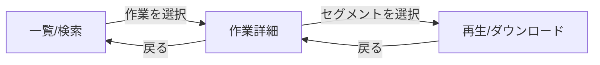

# WebUI基本設計書（React + Vite）

## 1. 目的
LAN内サーバーにアップロード（tus）された録画セグメントを、PC等のブラウザから検索・閲覧（再生/ダウンロード）できるWeb UIの基本設計を定義する。

## 2. 前提/制約
- 利用環境はLAN内を想定（公開インターネット運用は対象外）
- 動画はMP4（H.265 + AAC）を基本とする
  - ブラウザがH.265に非対応な場合があるため、UIは「再生不可」を前提にダウンロード導線を必ず持つ

運用負荷の低減（方針）
- H.265非対応ブラウザが混在する前提のため、Android側でH.264（互換モード）録画に切替可能とし、現場では互換モードを優先利用できるようにする
- 将来的に必要であれば、サーバー側で互換版（H.264やHLS等）を非同期生成し、UIが互換版を優先再生する方式も拡張として検討可能（本書の最小スコープ外）
- UIはWebサーバーと同一オリジンで提供する（CORS回避）
- 機能は最小（一覧/詳細/再生/ダウンロード）に限定する

## 3. 採用技術
- React + Vite
- UIは静的配信（Vite build成果物）
- API通信: `fetch`（必要に応じて薄いラッパーを用意する）

## 4. 画面/UX設計（最小）
### 4.1 画面一覧
- 一覧/検索: 検索条件入力、作業一覧（概要）
- 作業詳細: 作業メタデータ、セグメント一覧
- 再生/ダウンロード: 動画プレイヤー、ダウンロード

### 4.2 画面遷移

### 4.3 一覧/検索画面
**入力項目（最小）**
- 型式（model、部分一致可）
- 機番（serial、部分一致可）
- 工程（process、部分一致可）
- 日付範囲（recordedAtの期間: from/to）

**表示（最小）**
- 作業一覧（作業単位）
  - workId / model / serial / process
  - firstRecordedAt / lastRecordedAt
  - segmentCount

**挙動**
- 検索実行で `GET /api/works` を呼び出し、結果を表示する
- 新しい作業が上（lastRecordedAt降順）になる前提で表示する

### 4.4 作業詳細画面
**表示（最小）**
- 作業メタデータ（workId / model / serial / process）
- セグメント一覧（recordedAt昇順）
  - recordedAt
  - segmentIndex
  - ファイル名（または識別子）
  - ファイルサイズ（取得可能な場合）

**挙動**
- 画面表示時に `GET /api/works/{workId}` を呼び出す
- セグメント選択で再生/ダウンロード画面へ遷移

### 4.5 再生/ダウンロード画面
**要素（最小）**
- `<video controls>` を基本とする
- ダウンロードボタン（常に表示）

**再生戦略（H.265非対応への対処）**
- まず `GET /api/segments/{segmentId}/stream` を `<video src>` に設定して再生を試みる
- 再生できない場合（コーデック非対応等）
  - UIはクラッシュせず「再生不可」を明示する
  - `GET /api/segments/{segmentId}/download` への導線を提示する

**Rangeとシーク**
- サーバー側の `stream` はHTTP Range対応を必須寄り（MVPで実装）とする
- Range非対応の場合はシーク不可になり得る（UIはエラー表示せず、再生可否とダウンロード導線を優先）

識別子の区別:
- UIが扱う `segmentId` はサーバー側の参照IDであり、Android端末側の不変ID（`segmentUuid`）とは別物である。

## 5. API I/F（UI利用観点）
### 5.1 共通
- エラーはJSON（例: `{"error":"NOT_FOUND","message":"..."}`）
- UIはユーザー向けに分かるメッセージを表示する
  - NOT_FOUND: 対象が見つからない
  - SERVER_ERROR: サーバーでエラーが発生（再試行を促す）

### 5.2 エンドポイント（最小）
- `GET /api/processes`
  - Android向け工程候補。UIは基本的に直接利用しない（将来の検索入力補助に使う可能性はある）
- `GET /api/works?model&serial&process&from&to`
- `GET /api/works/{workId}`
- `GET /api/segments/{segmentId}/stream`
- `GET /api/segments/{segmentId}/download`

## 6. エラーハンドリング（UI）
- 一覧検索失敗: 画面内にエラー表示＋再試行導線
- 詳細取得失敗: 「取得に失敗しました」表示＋戻る導線
- ストリーミング失敗: 「再生不可」を表示し、ダウンロード導線を必ず表示

## 7. ビルド/デプロイ（UI）
- 開発時: Vite dev server
- 本番: `vite build` の成果物をWebサーバーから静的配信
  - UIとAPIは同一オリジン（例: `http://<Server IP Address>:8080/`）で提供する
