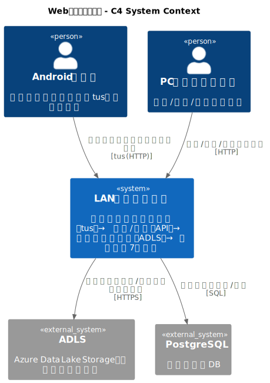
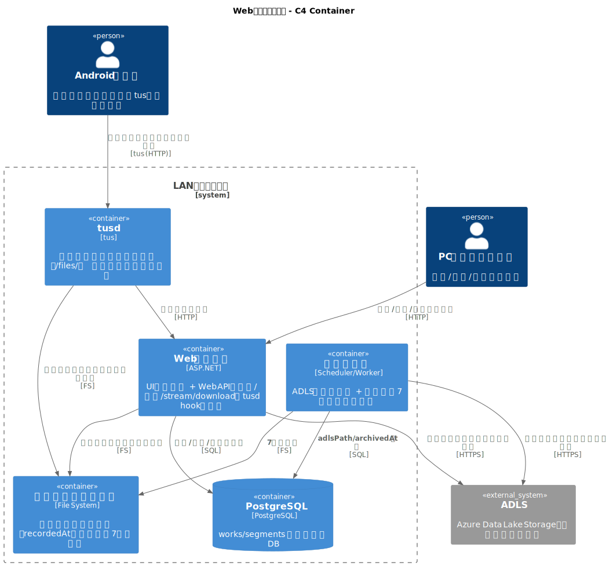
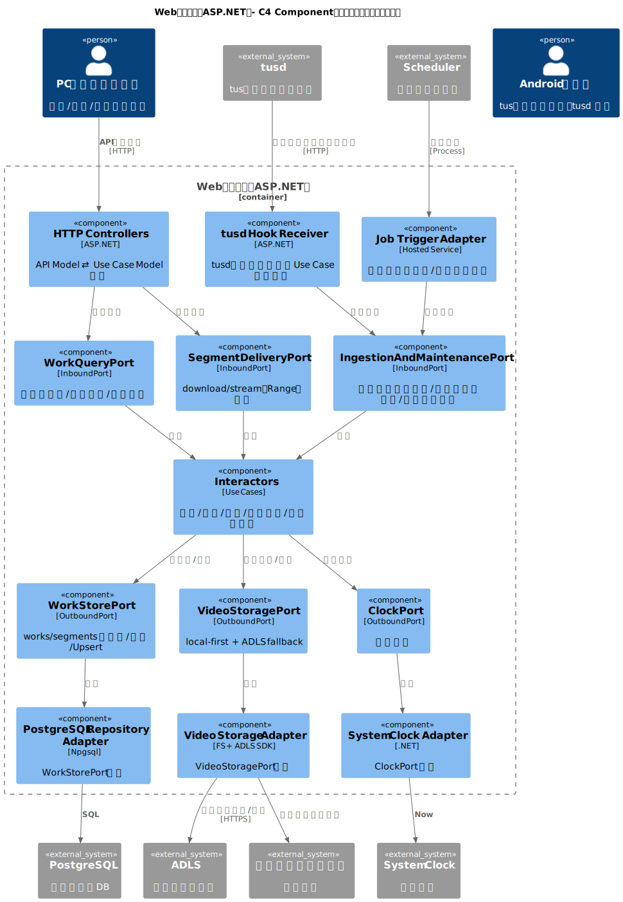

# Webアプリサーバー基本設計書

作成日: 2025-12-28

本書は、LAN内サーバーで「録画セグメントの受信（tus）→検索/配信（API）→日次アーカイブ（ADLS）→ローカル7日保持」を実現するWebアプリサーバーの基本設計を、クリーンアーキテクチャの考え方（依存は内側へ・境界で変換・ポート&アダプタ）に沿って整理する。

---

## 1. 目的 / スコープ
### 1.1 目的
- Androidアプリからアップロードされた録画セグメントを、Web APIとして検索/詳細/動画配信（stream/download）で提供する
- 日次でADLSへアーカイブし、ローカル保存は原則7日で削除する
- UI静的配信とWeb APIを同一オリジンで提供する（Web UIとセット運用）

### 1.2 対象外
- 公開インターネット向けの本格運用（WAF/ゼロトラスト/多要素認証等）は対象外
- 複雑な認可（ユーザー/ロール/監査ログ要件）

## 2. 前提 / 制約
- 利用環境はLAN内を想定（閉域）
- アップロードは再開可能方式（tus）で、受信は `tusd` を採用する
- tus受信口（tusd）は最初から前段にリバースプロキシを置き、最低限の防御を入れる
  - 簡易認証: `X-Api-Key` 等（内部誤送信や想定外端末のアップロード事故の予防）
  - IP制限: 許可リスト（allowlist）を基本
  - サイズ上限: 1ファイル/リクエスト/合計の上限（容量枯渇の予防）
  - 同時接続数制限/レート制限: 端末台数や帯域に合わせて上限設定
- 動画はMP4（H.265 + AAC）を基本とし、確実なダウンロード経路（/download）を必須とする
- ローカル保存は `receivedAt`（サーバー受信時刻）基準で原則7日保持し、それ以降は削除する（端末時刻ズレ対策）
- ADLSへ日次でアーカイブし、ローカル削除後もADLSから配信できる

---

## 3. アーキテクチャ方針（クリーンアーキテクチャ準拠）
本システムは「ポート&アダプタ」スタイルでクリーンアーキテクチャを適用し、UI/DB/ストレージ/クラウド等の変更が中心ロジックへ波及しにくい構造にする。

### 3.1 依存関係ルール（Dependency Rule）
- **ソースコードの依存は内側へ**：Use Case / Domain は、ASP.NET・DB実装・ADLS SDK・ファイルシステム等の具体に依存しない
- 外側（Framework/Driver）は、内側（Use Case/Domain）が定義した抽象（Port interface）を実装する

### 3.2 4つの同心円での責務
- **Entities（Domain）**：`Work` / `Segment` の概念と不変条件（業務ルール）
- **Use Cases（Application）**：検索/詳細/配信/アップロード完了処理/アーカイブ/保持期限削除
- **Interface Adapters**：HTTP Controller（API）、tusd hook受信、スケジューラ、Presenter/Mapper、Repository実装
- **Frameworks & Drivers**：ASP.NET、PostgreSQLドライバ、ADLS SDK、ローカルFS、tusd

### 3.3 モデル分離（境界で変換）
“万能DTOを全層で使い回す”は避ける。少なくとも次を分離し、境界（Controller/Presenter/Repository）で変換する。
- **Domain Model**：`Work` / `Segment`（不変条件の中心）
- **Use Case Model**：Use CaseのInput/Output（アプリ都合の入出力）
- **API Model**：HTTPリクエスト/レスポンス（公開I/Fの都合）
- **Persistence/Storage Model**：DBレコード、ADLSパス、ファイルパス等（外部仕様の都合）

### 3.4 Composition Root（組み立ての場所）
- 依存の結線は最外周（ASP.NETの起動点、DI設定）に集約する
- Use CaseやDomainにDIコンテナやFramework型（Controller/DbContext等）を持ち込まない

---

## 4. 全体構成（システムコンテキスト）
### 4.1 構成概要
- 動画受信: tusd（tusプロトコル）
- Webサーバー: ASP.NET（Web API + UI静的配信）
- メタデータDB: PostgreSQL
- ローカルストレージ: 受信済み動画（7日保持、receivedAt基準）
- 日次ジョブ: ADLSアップロード + ローカル7日削除

---

## 5. 論理アーキテクチャ（レイヤー/依存関係）
### 5.1 レイヤー定義
- **Domain（Entities）**
  - ドメイン概念: `Work` / `Segment`
  - 不変条件例: 作業キーの必須性、セグメント不変ID（`segmentUuid`）の一意性、セグメントindexの一意性（同一work内）、recordedAtの整合性
- **Application（Use Cases）**
  - 入力→処理→出力で表現する
  - DB/FS/ADLS/tusd等の詳細は知らず、Port interface越しに入出力する
- **Interface Adapters**
  - HTTP Controller（API）: API Model ⇄ Use Case Model
  - tusd Hook Receiver: tusdイベント ⇄ Use Case Model
  - Scheduler: トリガ ⇄ Use Case Model
  - Repository/Storage実装: Persistence/Storage Model ⇄ Domain Model
- **Frameworks & Drivers**
  - ASP.NET、PostgreSQL、ADLS SDK、ローカルFS、tusd

---

## 6. 主要ユースケース（最小セット）
本章は「何をするか」を中心に整理する。各ユースケースはUse Case Model（Input/Output）を持ち、外部I/OはOutbound Port経由で行う。

### 6.1 工程マスタ取得
- **目的**：工程候補一覧を返す
- **入力**：なし
- **出力**：工程リスト

### 6.2 作業一覧検索
- **目的**：条件（workId/model/serial/process/from/to）により作業一覧を返す
- **出力の並び順**：`lastRecordedAt` 降順

### 6.3 作業詳細取得
- **目的**：workIdに対して作業情報＋セグメント一覧を返す
- **セグメント順**：`recordedAt` 昇順

### 6.4 セグメント配信（download/stream）
- **目的**：segmentIdの動画コンテンツを返す
- **取得元**：ローカル優先。無い場合ADLSへフォールバック
- **stream**：HTTP Range対応（`206 Partial Content`）

### 6.5 アップロード完了処理（tusd hook）
- **目的**：tusd完了イベントを受け、ファイル確定・命名・DB反映を冪等に行う
- **重要**：再通知/再実行でもDB不整合にならないこと（冪等性）

### 6.6 日次アーカイブ（ADLS）
- **目的**：未アーカイブ分をADLSへアップロードし、DBへ `adlsPath/archivedAt` を反映
- **重要**：失敗時は次回再試行できること（冪等性）

### 6.7 保持期限削除（ローカル7日）
- **目的**：`receivedAt`（サーバー受信時刻）基準で7日超のローカル動画を削除（端末時刻ズレ対策）
- **前提**：ADLSに存在（または参照可能）

---

## 7. 境界インタフェース（Ports）
### 7.1 Inbound Ports（ユースケース入口）
Inboundは「外部イベント/リクエストをUse Case呼び出しへ変換する境界」。HTTP/tusd/スケジューラはここを呼ぶ。
- `WorkQueryPort`：工程マスタ/作業一覧/作業詳細の取得（読み取り系）
- `SegmentDeliveryPort`：セグメント配信（download/stream、Range含む）
- `IngestionAndMaintenancePort`：tusd完了処理/日次アーカイブ/保持期限削除（取り込み・保守系）

### 7.2 Outbound Ports（外部I/Oの抽象）
Use Caseは以下の抽象にのみ依存し、具体実装は外側に置く。
- `WorkStorePort`：工程/作業/セグメントの永続化（取得/検索/Upsert、アーカイブ状態更新）
- `VideoStoragePort`：動画の保存/取得（ローカル・ADLSを内部で扱う。配信はローカル優先→ADLSフォールバック）
- `ClockPort`：現在時刻（`createdAt/updatedAt/archivedAt`）

---

## 8. データ設計（PostgreSQL）
### 8.1 基本方針
- 検索/一覧/詳細の応答は **DBを唯一の正** とする（FS走査に依存しない）
- tusd完了処理でファイル確定と同時にDBへ登録/更新
- ADLSアーカイブ完了後にDBへ `adls_path/archived_at` を反映

### 8.2 テーブル（最小）
`works`（作業単位）
- `work_id` TEXT PRIMARY KEY
- `model` TEXT NOT NULL
- `serial` TEXT NOT NULL
- `process` TEXT NOT NULL
- `first_recorded_at` TIMESTAMPTZ NOT NULL
- `last_recorded_at` TIMESTAMPTZ NOT NULL
- `segment_count` INTEGER NOT NULL
- `created_at` TIMESTAMPTZ NOT NULL
- `updated_at` TIMESTAMPTZ NOT NULL

`segments`（セグメント単位）
- `segment_id` UUID PRIMARY KEY
- `segment_uuid` UUID NOT NULL
- `work_id` TEXT NOT NULL
- `segment_index` INTEGER NOT NULL
- `recorded_at` TIMESTAMPTZ NOT NULL
- `received_at` TIMESTAMPTZ NOT NULL
- `duration_sec` INTEGER NULL
- `size_bytes` BIGINT NULL
- `local_path` TEXT NOT NULL
- `sha256` TEXT NULL
- `adls_path` TEXT NULL
- `archived_at` TIMESTAMPTZ NULL
- `created_at` TIMESTAMPTZ NOT NULL
- `updated_at` TIMESTAMPTZ NOT NULL

制約（同一セグメントの一意性）
- `segments.segment_uuid` は一意（UNIQUE）とする（端末生成の不変ID）

補足:
- `segment_id` は Web API で参照するためのサーバー採番ID（内部ID）。
- `segment_uuid` は Android端末がセグメント生成時に発行する不変ID（UUID）であり、冪等処理・重複判定・ログ相関の中心とする。

外部キー
- `segments.work_id` → `works.work_id`

インデックス（検索用途）
- `segments(work_id, recorded_at)`
- `works(model)`, `works(serial)`, `works(process)`

### 8.3 `recordedAt` の表現
- 端末→サーバー→ADLS→Web UI で同一の表現・タイムゾーンで扱う
- DBは `TIMESTAMPTZ` を基本とし、APIはISO 8601（タイムゾーン付き）で返す

補足（端末時刻ズレ対策）
- `received_at` はサーバーが受信時に付与する時刻（`TIMESTAMPTZ`）であり、保持期限・監視用途は `received_at` を優先できるようにする。

---

## 9. Interface Adapters 設計
### 9.1 動画受信（tusd）
#### 9.1.1 tusエンドポイント
- 例: `http://<Server IP Address>:1080/files/`

補足（防御）
- 運用時は tusd を直接公開せず、前段のリバースプロキシ配下へ配置し、`X-Api-Key` 等の簡易認証・IP制限・サイズ上限・同時接続数制限を適用する。

#### 9.1.2 受信メタデータ
- 必須: `segmentUuid`, `workId`, `model`, `serial`, `process`, `segmentIndex`, `recordedAt`
- 任意: `durationSec`, `deviceId`, `appVersion`

サーバー側で付与/保持:
- `receivedAt`（受信時刻、サーバー時刻）

補足:
- `segmentUuid` は端末生成の不変ID（UUID）であり、後追い紐づけや `segmentIndex` の再採番が発生しても同一セグメントを一意に識別できる。
- サーバー側の冪等処理・重複判定・ログ相関の中心は `segmentUuid` とする（`segmentIndex` は揺れるため）。

#### 9.1.3 完了フック（tusd → Webサーバー）
アップロード完了時に、tusdのフック（HTTP通知または実行フック）でWebサーバーへ完了イベントを渡す。

**tusd Hook Receiver（Inbound Adapter）の責務**
- tusdが提供する完了イベントを受信する
- API Model（tusdイベント）を Use Case Model に変換し `IngestionAndMaintenancePort` を呼ぶ

**UploadCompleted（Use Case）の責務（冪等）**
1) 一時ファイルを正式保存先へ移動（必要な場合）
2) 命名規則に従いリネーム
3) DBへ `works` / `segments` を登録または更新（`segmentUuid` をキーにUpsert/冪等化）
4) 失敗時はログへ詳細を記録し、再処理可能な状態（再実行でDB不整合にならない）を保つ

### 9.2 Web API（HTTP Controller）
#### 9.2.1 共通
- 例外時はJSONでエラーを返す（API Model）
  - 例: `{"error":"NOT_FOUND","message":"..."}`
- LAN内運用でも、最初から前段のリバースプロキシで簡易認証（`X-Api-Key` 等）やIP制限などの最低限防御を入れ、内部誤送信・想定外端末からのアクセス事故を予防する

#### 9.2.2 エンドポイント（最小）
工程マスタ（Android向け）
- `GET /api/processes`

作業一覧検索
- `GET /api/works`
  - query: `workId`, `model`, `serial`, `process`, `from`, `to`
  - 並び順: `lastRecordedAt` 降順

作業詳細
- `GET /api/works/{workId}`
  - セグメント一覧は `recordedAt` 昇順

ダウンロード（必須）
- `GET /api/segments/{segmentId}/download`
  - `Content-Disposition: attachment`
  - 取得元: ローカル優先、無ければADLS

ストリーミング（推奨）
- `GET /api/segments/{segmentId}/stream`
  - HTTP Range対応（`206 Partial Content`）
  - 取得元: ローカル優先、無ければADLS

#### 9.2.3 Range応答（/stream）
- `Range: bytes=<start>-<end>` がある場合は `206 Partial Content`
- ヘッダ例
  - `Accept-Ranges: bytes`
  - `Content-Range: bytes <start>-<end>/<total>`
  - `Content-Length: <partialLength>`
- Range無しは `200 OK` で全体返却

### 9.3 重複アップロード（再送）時の扱い
- `segment_id` はサーバー採番（UUID）とし、Web API（`/api/segments/{segmentId}`）等の参照IDとして用いる
- 端末生成の `segmentUuid` を同一セグメント識別の中心とし、DBで一意制約（`segments.segment_uuid` UNIQUE）を持つ
- 重複判定/冪等処理
  - `segmentUuid` が一致した場合は同一セグメントとして扱い、tusd再通知/再送でもDBが増殖しないようにする
  - `segmentUuid` が異なる場合は別セグメントとして扱う（内容が同一に見えても別扱い）
- 採用方針（基本）
  - 同一 `segmentUuid` の再送は冪等に処理し、同一行を更新（上書き/無視のルールは実装で確定）
  - 異なる `segmentUuid` の重複（人為/端末不具合等）は「別セグメント」として保持し、UIにも別として表示

---

## 10. ジョブ設計（ADLSアーカイブ / 保持期限）
### 10.1 ADLS保存先
- 例: `/videos/YYYY/MM/DD/<workId>/...`

### 10.2 日次アーカイブ
- 1日1回、未アーカイブ分をADLSへアップロード（失敗時は次回再試行・冪等）
- 成功後、DBへ `adls_path` / `archived_at` を更新

### 10.3 ローカル7日削除
- `receivedAt`（サーバー受信時刻）基準で7日超のローカル動画を削除（端末時刻ズレ対策）
- 削除対象は「ADLSに存在する（または参照可能）」を前提
  - 例外（運用判断）: ADLS未アーカイブのまま7日超は削除しない/アラート

---

## 11. エラーハンドリング / 冪等性 / 整合性
### 11.1 エラーハンドリング（基本）
- 失敗を握りつぶさず、原因が追えるログ（相関ID/segmentUuid/segmentId/workId等）を残す
- 外部I/O（DB/FS/ADLS）の例外はUse Case境界で扱い、API層へは安定したエラー形式で返す

### 11.2 冪等性
- tusd完了イベントは再通知され得る前提で **二重登録・二重移動** を回避する
- アーカイブジョブは **再実行可能**（途中失敗後に再開しても二重アップロード/二重更新にならない）

### 11.3 整合性（最小方針）
- “ファイルはあるがDBが無い” “DBはあるがファイルが無い” を検知し、運用で調査できるログを残す
- 配信は「ローカル優先→ADLSフォールバック」で成立するようにする

---

## 12. テスト方針
- Domain / Use Caseはユニットテスト可能にする（Outbound Portをモック）
- Adapter層は結合テスト（DB/FS/ADLSはテスト用に差し替え）
- Range配信は、ヘッダ/ステータス（200/206）を中心にテスト観点を持つ

---

## 13. 監視 / ログ
- tusd: アップロード開始/完了/失敗
- Webサーバー: APIアクセス（検索/詳細/stream/download）、例外ログ
- DBエラー、ADLSアップロード失敗、ローカル削除失敗
- ディスク使用率（閾値アラート）

---

## 14. 起動 / デプロイ（最小）
- tusd: サービスとして常駐
- Webサーバー: UI静的配信 + Web API を同一オリジンで提供
- 開発時: UI（Vite dev server）とAPI（ASP.NET）を別プロセスで起動

---

## 15 C4 Diagram（PlantUML / オフライン対応）
本図は、[docs/c4](c4/) 配下の `.puml` をSVGへレンダリングした成果物（[docs/c4/out](c4/out/) 配下の `.svg`）をMarkdownへ画像として埋め込み、Markdownプレビューでも表示できるようにした。

再生成:
- [docs/c4/render_svgs.sh](c4/render_svgs.sh)（PlantUMLコマンドが必要）

### A.1 System Context

ソース: [docs/c4/WebServer_SystemContext.puml](docs/c4/WebServer_SystemContext.puml)

### A.2 Container

ソース: [docs/c4/WebServer_Container.puml](docs/c4/WebServer_Container.puml)

### A.3 Component（Webサーバー / クリーンアーキテクチャ）

ソース: [docs/c4/WebServer_Component.puml](docs/c4/WebServer_Component.puml)
