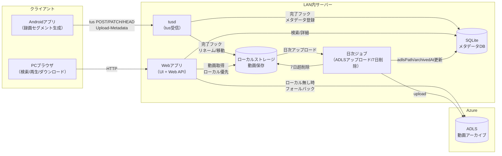
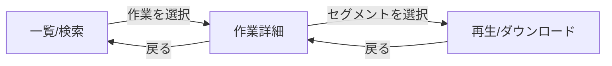

# Webアプリ基本設計書

## 1. 目的
Androidアプリ（UVCCameraDemo）からLAN内サーバーへアップロード（tus）された録画セグメントを、Webブラウザから検索・閲覧（再生/ダウンロード）できるWebアプリの基本設計（構成/データ/API/運用）を定義する。

## 2. 前提/制約
- 利用環境はLAN内を想定する（公開インターネット運用は対象外）
- 動画はMP4（H.265 + AAC）を基本とする
  - ブラウザがH.265に非対応な場合があるため、Web UIは「再生できない」可能性を前提にダウンロード導線を必ず持つ
- Android側は「作業に紐づくセグメント（割当済み）」のみアップロードする前提とする（未割当は基本アップロード対象外）
- アップロードは再開可能方式（tus）とし、LAN内HTTPで運用する
- 受信済み動画は毎日ADLS（Azure Data Lake Storage）へアップロード（アーカイブ）する
- ローカル（サーバー）に保存された動画は原則7日で削除する（録画日時 `recordedAt` 基準）
- ローカル削除後も、ADLS上の動画をWebアプリから再生/ダウンロードできること

## 3. 用語
- 作業ID（`workId`）: 1作業（開始〜終了）を一意に識別するID。端末側で発行され、アップロードメタデータとしてサーバーへ送られる。
- 録画セグメント: 一定間隔/作業操作で分割された録画ファイル単位。
- `recordedAt`: セグメントの撮影日時。検索/保持期間/アーカイブ日付分割の基準となる。
- `segmentIndex`: 同一`workId`内の順序。

## 4. 全体構成
### 4.1 構成概要
- tusサーバー（tusd想定）: Androidからのアップロード受信
- Webアプリ
  - UI: React + Vite
  - Web API: 検索/詳細/動画配信（ストリーム/ダウンロード）
- メタデータDB: SQLite（単一サーバー・LAN内運用を前提に軽量構成）
- ローカルストレージ: 受信済み動画（7日保持）
- 日次ジョブ: ADLSアップロード + ローカル7日削除

### 4.2 システム構成図


### 4.3 ネットワーク
- Android端末 → tusサーバー：LAN内HTTP
- ブラウザ → Webアプリ：LAN内HTTP
- 推奨：サーバーはLAN内の固定IPで稼働（例：`<Server IP Address>`）

## 5. データ設計
### 5.1 ディレクトリ構成（ローカル）
- tusd作業領域（受信中/一時）: `/data/uvc/tusd/`
- 正式保存先（受信完了後）: `/data/uvc/videos/YYYY/MM/DD/<workId>/`

### 5.2 `recordedAt` の表現
- 端末→サーバー→ADLS→Web UI で同一の表現・タイムゾーンとする
- 具体フォーマットは以下を推奨し、確定後は全系統で統一する
  - `YYYY-MM-DDTHH:mm:ss.SSSXXX`（ISO 8601、タイムゾーン付き）

### 5.3 ファイル命名規則（ローカル/ADLS共通思想）
運用・調査性（いつ/どの作業/何番目）を重視し、最低限の識別子をファイル名に含める。

- 推奨: `<recordedAt>_<workId>_seg<segmentIndex>_<deviceId>.mp4`
  - `deviceId` が無い場合は省略可

### 5.4 メタデータDB（SQLite）
#### 5.4.1 保持方針
- Web検索/一覧/詳細の応答はDBを唯一の正とする（ファイルシステム走査に依存しない）
- tus完了フックで動画ファイルの確定と同時にDBへ登録/更新する
- ADLSアーカイブ完了後にDBへ `adlsPath` / `archivedAt` を反映する

#### 5.4.2 テーブル（最小）
`works`（作業単位）
- `workId` TEXT PRIMARY KEY
- `model` TEXT
- `serial` TEXT
- `process` TEXT
- `firstRecordedAt` TEXT
- `lastRecordedAt` TEXT
- `segmentCount` INTEGER
- `createdAt` TEXT NOT NULL
- `updatedAt` TEXT NOT NULL

`segments`（セグメント単位）
- `segmentId` TEXT PRIMARY KEY（サーバー側でUUID採番）
- `workId` TEXT NOT NULL
- `segmentIndex` INTEGER NOT NULL
- `recordedAt` TEXT NOT NULL
- `durationSec` INTEGER NULL
- `sizeBytes` INTEGER NULL
- `localPath` TEXT NOT NULL
- `sha256` TEXT NULL（任意：重複検知/監査用。最初は未実装でも可）
- `adlsPath` TEXT NULL
- `archivedAt` TEXT NULL
- `createdAt` TEXT NOT NULL
- `updatedAt` TEXT NOT NULL

外部キー
- `segments.workId` → `works.workId`

インデックス
- `segments(workId, recordedAt)`
- `works(model)`, `works(serial)`, `works(process)`（検索用途）

### 5.5 重複アップロード（再送）時の扱い
通信断などで同一セグメントが再送されても、参照側が破綻しないことを基本設計として保証する。

- DBは `segmentId` をサーバー採番にして重複登録で壊れないようにする
- 追加の重複判定キー（推奨）
  - `workId + recordedAt + segmentIndex + sizeBytes` が一致した場合は「同一候補」とみなし、ログに記録した上でどちらを採用するかを決める
- 採用方針（基本）
  - 先着を正として維持し、後着は別ファイルとして保管（ファイル名に `_dupN` を付与）
  - Web UIには正（先着）を表示し、必要があれば管理者向けに重複を確認できるログを残す

## 6. アップロード受信（tus）設計
### 6.1 tusエンドポイント
- 例: `http://<Server IP Address>:1080/files/`

### 6.2 受信メタデータ
Android側の要件に合わせ、最低限以下を受け取れること。

- 必須: `workId`, `model`, `serial`, `process`, `segmentIndex`, `recordedAt`
- 任意: `durationSec`, `deviceId`, `appVersion`

### 6.3 完了フック（tusdのhook/イベント）
アップロード完了時に、以下を必ず実施する。

1) 一時ファイルを正式保存先へ移動
2) 命名規則に従いリネーム
3) メタデータDBへ `works` / `segments` を登録または更新
4) 失敗時はログへ詳細を記録し、再処理可能な状態（再実行でDB不整合にならない）を保つ

## 7. Web UI設計（画面）
### 7.1 画面一覧
- 一覧/検索画面: 検索条件入力、作業一覧
- 作業詳細画面: 作業メタデータ、セグメント一覧
- 再生画面: 動画プレイヤー、ダウンロード

### 7.2 画面遷移


## 8. Web API設計
### 8.1 共通
- 認証は必須要件ではないが、必要になった場合に前段のリバースプロキシでAPIキー検証できるようにする
- 例外時はJSONでエラーを返す
  - 例: `{"error":"NOT_FOUND","message":"..."}`

### 8.2 エンドポイント（最小）
#### 8.2.1 作業一覧検索
- `GET /api/works`
  - query: `workId`, `model`, `serial`, `process`, `from`, `to`
  - from/to は `recordedAt` の期間
  - response: 作業一覧（概要＋期間＋セグメント数）
  - 並び順: `lastRecordedAt` の降順（新しい作業を先頭）

レスポンス例（概念）:
```json
{
  "items": [
    {
      "workId": "...",
      "model": "...",
      "serial": "...",
      "process": "...",
      "firstRecordedAt": "...",
      "lastRecordedAt": "...",
      "segmentCount": 3
    }
  ]
}
```

#### 8.2.2 作業詳細
- `GET /api/works/{workId}`
  - response: 作業メタデータ＋セグメント一覧（recordedAt昇順）

レスポンス例（概念）:
```json
{
  "work": {
    "workId": "...",
    "model": "...",
    "serial": "...",
    "process": "..."
  },
  "segments": [
    {
      "segmentId": "...",
      "segmentIndex": 1,
      "recordedAt": "...",
      "sizeBytes": 123456,
      "archived": true
    }
  ]
}
```

#### 8.2.3 ダウンロード（必須）
- `GET /api/segments/{segmentId}/download`
  - 仕様: 確実に取得できることを優先し `Content-Disposition: attachment` を基本とする
  - 取得元: ローカル優先、無ければADLS

#### 8.2.4 ストリーミング（推奨）
- `GET /api/segments/{segmentId}/stream`
  - 仕様: ブラウザ内再生/シークのためにHTTP Rangeに対応する
  - 取得元: ローカル優先、無ければADLS

### 8.3 再生戦略（H.265非対応への対処）
- UIはまず `stream` で再生を試み、失敗時（コーデック非対応等）は「再生不可」を明示し `download` へ誘導する
- Range未対応の場合はシーク不可となるため、`stream` はRange対応を基本とする

### 8.4 Range応答（`/stream`）
- 要求に `Range: bytes=<start>-<end>` が含まれる場合は `206 Partial Content` を返す
- 応答ヘッダ（例）
  - `Accept-Ranges: bytes`
  - `Content-Range: bytes <start>-<end>/<total>`
  - `Content-Length: <partialLength>`
- `Range` が無い場合は `200 OK` で全体を返す

## 9. ADLSアーカイブ/保持設計
### 9.1 ADLS保存先
- 例: `/videos/YYYY/MM/DD/<workId>/...`

### 9.2 日次ジョブ
- 1日1回（時刻は運用で決定）、未アーカイブ分をADLSへアップロード
- 成功後、DBへ `adlsPath` / `archivedAt` を更新
- 失敗時は次回に再試行（冪等にする）

### 9.3 ローカル7日削除
- `recordedAt` を基準に7日を超えたローカル動画を削除
- 削除対象は「ADLSに存在する（または参照可能である）こと」を前提にする
  - 例外扱い（運用判断）: ADLS未アーカイブのまま7日超の場合は削除しない/アラート

## 10. 監視/ログ
- アップロード開始/完了/失敗（tusd側ログ＋完了フックログ）
- Web APIアクセスログ（検索/詳細/stream/download）
- DBエラー、ADLSアップロード失敗、ローカル削除失敗
- ディスク使用率（閾値アラート）

## 11. セキュリティ/アクセス制御
- LAN内HTTP運用のため、盗聴/改ざんリスクがある
- 運用で以下を前提とする
  - サーバーはLAN内セグメントに限定
  - 受信ポート/閲覧ポートは社内LANからのみ許可
  - 外部公開しない
- 認証を追加する場合
  - 推奨: リバースプロキシでAPIキー検証（`X-Api-Key` など）

## 12. 起動/デプロイ（最小）
- tusd をサービスとして常駐
- Webアプリは「UI（静的配信）＋Web API」を同一オリジンで提供（CORS回避）
- 開発時はUI（Vite dev server）とAPIを別プロセスで起動
